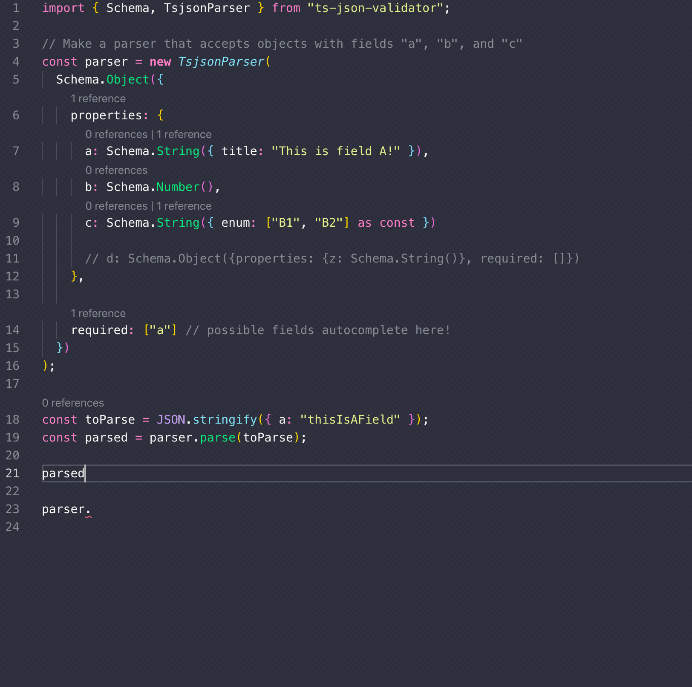

ts-json-validator
------

[](https://codecov.io/gh/ostrowr/ts-json-validator) [](https://github.com/prettier/prettier) [](https://github.com/ostrowr/ts-json-validator/actions) [](https://www.npmjs.com/package/ts-json-validator)

Let JSON play nicely with Typescript.

### ⚠️ Warning: This project requires some features from Typescript 3.7, which was just released!

## Type once, check all the time



Naturally, all of the code you write is typed perfectly. But you're not in charge of all that pesky data that
comes from other places.

`JSON.parse` returns type `any`, which mangles all of your hard-earned strictness.

JSON validators are great, but they usually require you to define two things: the validation function and the
Typescript type to go along with it. These can get out of sync and are generally a pain to maintain. JSON schema is
a terrific idea, but the schemas are often tricky to write and even trickier to understand.

`ts-json-validator` allows you to define everything in one place. It generates a compliant JSON schema, a Typescript type
that matches objects that can be parsed by that schema, and provides a typesafe `parse` that throws if the JSON you get
doesn't match the type you're expecting.

This project uses [ajv](https://github.com/epoberezkin/ajv) under the hood for fast JSON validation against a schema. If
you don't want to validate every time, but still want a way to define a JSON schema that you can use as a Typescript
type, that's OK too.

`ts-json-validator` exposes a pretty small API. It allows you to create and validate against a schema compliant with
[draft-07 of JSON Schema](http://json-schema.org/draft-07/schema#) that also exposes a strict Typescript type expressing
the types assignable to the schema. `ts-json-validator` implements all of draft-07.

## Usage
First, import the important stuff:

`import { createSchema as S, TsjsonParser, Validator } from "ts-json-validator"`

Then define a schema. `ts-json-validator` currently supports every keyword, though not all of them contribute to the final derived type.

Let's say we want to define a schema that accepts objects with fields "a", "b", and "c".
"a" is a required string, "b" is an optional number, and "c" is an optional string that can only take on the values "B1" or "B2".

```
// Make a parser that accepts objects with fields "a", "b", and "c"
const parser = new TsjsonParser(
  S({
    type: "object",
    properties: {
      a: S({ type: "string", title: "This is field A" }),
      b: S( {type: "number"} ),
      c: S({ type: "string", enum: ["B1", "B2"] as const })
    },
    required: ["a"] // possible fields autocomplete here
  })
);
```

You can see the generated schema:

```
JSON.stringify(parser.schema)
/*
{
  "type": "object",
  "properties": {
    "a": {
      "type": "string",
      "title": "This is field A"
    },
    "b": {
      "type": "number"
    },
    "c": {
      "type": "string",
      "enum": [
        "B1",
        "B2"
      ]
    }
  },
  "required": [
    "a"
  ]
}
*/
```

Or parse some string:

```
const stringToParse = JSON.stringify({ a: "Value for field A" });

const parsed = parser.parse(stringToParse);
/* parsed is of type
{
  a: string,
  b?: number,
  c?: "B1" | "B2"
}*/

console.log(parsed)
// { a: 'Value for field A' }
```

If you parse a string that doesn't match the schema and so can't be assigned to the expected type, it throws
```
const stringToParse = JSON.stringify({ a: "Value for field A", c: "Invalid" });

const parsed = parser.parse(stringToParse);
// throws
// Error: [{"keyword":"enum","dataPath":".c","schemaPath":"#/properties/c/enum","params":{"allowedValues":["B1","B2"]},"message":"should be equal to one of the allowed values"}]
```

You can skip validation, of course, but this is dangerous if you don't control the input:
```
const parsed = parser.parse(stringToParse, true);
// no validation; parsed might be the wrong type here.
```

If you just want to validate an object against the schema, but have no need to parse it, run

`parser.validates(obj)`

This is a type guard that returns `true` if obj can be validated by parser, otherwise `false`.

```
if (parser.validates(obj))
 // obj is the correct type in here
)
// obj is the unvalidated type out here
```

If you have a schema and want to use its type in helper functions, there is a helper type `Validated<T>`
such that `Validated<typeof schema>` is the type defining all types that are assignable to this `schema`.

See the tests for more examples.

## Goal
Ultimately, I hope that this can generate Typescript type/JSON schema pairs `<T, s>` such that

1. Any type that `s` can validate is assignable to `T`
2. As few types as possible that are assignable to `T` cannot be validated by `s`.

- Step (1) is easily possible by assigning type `T` = any, but we want to narrow the type as far as possible to make this
library actually useful.
- Step (2) is generally impossible when validating against keywords that don't have a related type constraint (e.g. it's
not really possible to have a type expressing all numbers between 0 and 1) but we can do a lot here for many keywords.


ENFORCED (💪) indicates that the field is enforced by the type system, and it should be
impossible for any type assignable to `T` to fail JSON validation because of constraints
that this field introduces.

For example, the `required` field on objects is ENFORCED because a type assignable to `T` is guaranteed to contain
all fields marked `required`.

PARTIALLY ENFORCED (🔓) indicates that the field is partially enforced by the type system, but it may be possible
to assign a type to `T` that fails validation against `s`.

For example, arrays with the `additionalItems` parameter are PARTIALLY ENFORCED becuase (currently) every element
in the validated type can be assigned to the additionalItems type, when only items after `items.length` should
be validated against this schema.

NOT ENFORCED (⚠️) indicates that the field is not enforced by the type system. This is either because it's impossible
to do so efficiently given Typescript, or because I haven't figured out how yet. If the latter, hopefully I've
included a comment.

For example, the `pattern` constraint in a string type is NOT ENFORCED because there's no reasonable way to
express a type that means "a string that matches this regex".

NO ENFORCEMENT NEEDED (🤷) (means that this field does not add any constraints to a JSON schema so is essentially a comment.

NOT SUPPORTED (❌) means you can't currently define a TsjsonSchema that includes this validation keyword :(


| Keyword | Enforcement | Notes |
|------|----|-----|
| additionalProperties| 💪 | |
| allOf| 💪 | |
| anyOf| 💪 | |
| const | 💪 | |
| default | 💪 | Can only be assigned types that the rest of the schema validates |
| else| 💪 | Only matters if `if` is supplied |
| enum| 💪 | |
| properties| 💪 | |
| required | 💪 | |
| then| 💪 | Only matters if `if` is supplied |
| type| 💪 | Currently only supports single types (not lists of types) |
| additionalItems| 🔓 | Enforced with some limitations |
| items| 🔓 |Enforced if a schema, with limitations if a list of schemas |
| oneOf| 🔓 | currently enforced as anyOf |
| dependencies| 🔓 | Dependency schemas are not yet enforced. |
| $comment| 🤷 | |
| $id| 🤷 | |
| $schema | 🤷 | |
| contentEncoding| 🤷 | |
| contentMediaType| 🤷 | |
| description| 🤷 | |
| examples| 🤷 | |
| if| 🤷 | if doesn't actually add any constraints unless `then` or `else` are available |
| readOnly| 🤷 | |
| title| 🤷 | |
| contains| ⚠️ |Still investigating enforcemnt |
| exclusiveMaximum| ⚠️ | Can't enforce using type system |
| exclusiveMinimum| ⚠️ | Can't enforce using type system |
| format| ⚠️ | Can't enforce using type system |
| maximum| ⚠️ | Can't enforce using type system |
| maxItems| ⚠️ | Can't enforce using type system |
| maxLength| ⚠️ | Can't enforce using type system |
| maxProperties| ⚠️ | Can't enforce using type system |
| minimum| ⚠️ | Can't enforce using type system |
| minItems| ⚠️ | Can't enforce using type system |
| minLength| ⚠️ | Can't enforce using type system |
| minProperties| ⚠️ | Can't enforce using type system |
| multipleOf| ⚠️ | Can't enforce using type system |
| not| ⚠️ | Still investigating enforcement |
| pattern| ⚠️ | Can't enforce using type system |
| patternProperties| ⚠️ | Can't enforce using type system |
| propertyNames| ⚠️ | Can't enforce using type system |
| uniqueItems| ⚠️ | Can't enforce using type system |
| $ref| ⚠️ | Still investigating enforcement. If you want a recursive type, you can use $ref, but the typescript type will not be strict. If you just want to refer to another type, don't use $ref – just assign a schema to a variable and use it in multiple places. |
| definitions| ⚠️ | Still investigating enforcement along with $ref. |

See [src/tsjson-parser.ts](./src/tsjson-parser.ts) for more details, and [the tests](./stc/tsjson.test.ts) for interactive examples.

## Installation
`npm i ts-json-validator`

## How does all this work?
The object built up has the structure of a valid JSON schema with one extra magic feature: a hidden symbol that every
schema uses to hold its own type.

## Stability
The API is subject to change until 1.0, but the runtime behavior is very straightforward and is unlikely to be any
more dangerous than ajv by itself. If you want to use this in a production-critical environment, I recommend pinning
an exact release until 1.0 is out.

## Contributing
Please do!
